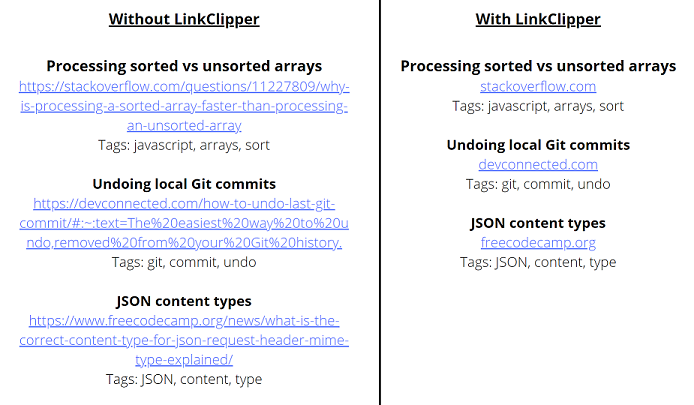

# LinkClipper

View the NPM package [here](https://www.npmjs.com/package/linkclipper).

LinkClipper is a package to help developers to easily shorten any URLs that they want to display to users in their apps.

For example you may have a resource-sharing app where users can submit their own links to share with others, and you have a page where you want to display a list of resources to the users, where each resource has a title, link, description, tags etc. However you don't want to show the full link address (such as 'https://www.stackoverflow.com/questions/11227809/why-is-processing-a-sorted-array-faster-than-processing-an-unsorted-array'), you just want to show the site name (such as 'stackoverflow.com'). LinkClipper can handle this URL shortening for you automatically.

## Contents

1. [Purpose](#purpose)

2. [Usage](#usage)

3. [Future plans](#future-plans)

4. [Acknowledgements](#acknowledgements)

5. [Contributors](#contributors)

## Purpose

With this project our goal was to create a simple package that would be helpful for other developers, and also to learn how packages can be published to NPM.

## Usage

### Syntax

    clipper(url, start, end)

### Parameters

`url`

The URL string to be shortened.

`start`

The extent to which to clip the beginning of the URL string. The options are 'none', 'shorten' and 'remove'.

`end`

The extent to which to clip the end of the URL string. The options are 'none', 'shorten' and 'remove'.

> Note: If the `end` parameter is set to 'remove', you should strongly consider setting the `start` parameter to also be 'remove'. Otherwise your returned string will look unusual.

### Return value

A new string containing the clipped URL. The original string is not modified.

### Examples

    import clipper from 'linkclipper';
    
    const url = 'https://www.stackoverflow.com/questions/11227809/why-is-processing-a-sorted-array-faster-than-processing-an-unsorted-array';

    console.log(clipper(url, 'none', 'none')) // OUTPUT: 'https://www.stackoverflow.com/questions/11227809/why-is-processing-a-sorted-array-faster-than-processing-an-unsorted-array'

    console.log(clipper(url, 'shorten', 'none')) // OUTPUT: 'www.stackoverflow.com/questions/11227809/why-is-processing-a-sorted-array-faster-than-processing-an-unsorted-array'

    console.log(clipper(url, 'remove', 'none')) // OUTPUT: 'stackoverflow.com/questions/11227809/why-is-processing-a-sorted-array-faster-than-processing-an-unsorted-array'

    console.log(clipper(url, 'none', 'shorten')) // OUTPUT: 'https://www.stackoverflow.com'

    console.log(clipper(url, 'shorten', 'shorten')) // OUTPUT: 'www.stackoverflow.com'

    console.log(clipper(url, 'remove', 'shorten')) // OUTPUT: 'stackoverflow.com'

    console.log(clipper(url, 'none', 'remove')) // OUTPUT: 'https://www.stackoverflow'

    console.log(clipper(url, 'shorten', 'remove')) // OUTPUT: 'www.stackoverflow'

    console.log(clipper(url, 'remove', 'remove')) // OUTPUT: 'stackoverflow'

## Future plans

- 

## Acknowledgements

- [How To Create And Publish Your First NPM Package - Web Dev Simplified](https://www.youtube.com/watch?v=J4b_T-qH3BY&ab_channel=WebDevSimplified)

## Contributors

- Philip Kaminski ([GitHub](https://github.com/AureaFlamma) | [LinkedIn](https://www.linkedin.com/in/kaminskp/))
- Dan Hawkesford ([GitHub](https://github.com/dhawkesford/) | [LinkedIn](https://www.linkedin.com/in/daniel-hawkesford/))

[Back to top](#linkclipper)